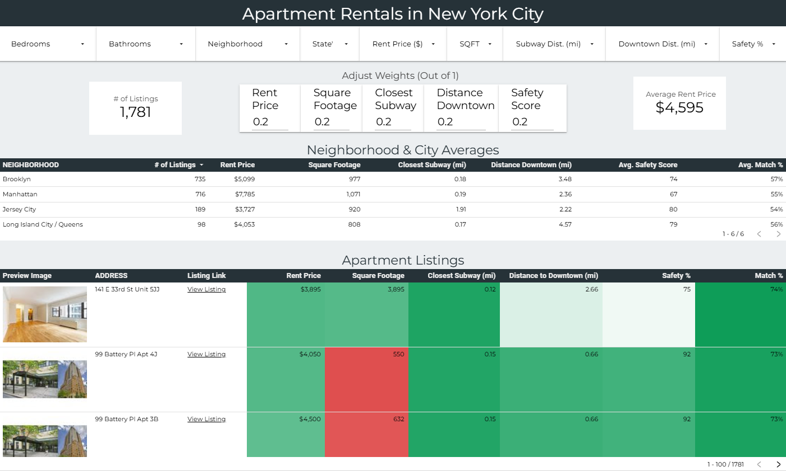
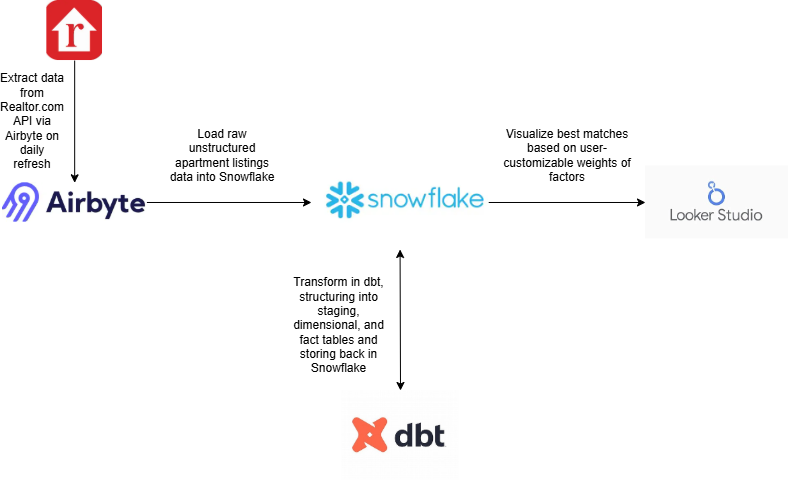

# NYC Apartment Search Dashboard

Explore the interactive Looker Studio dashboard:

**[NYC Apartment Search Dashboard](https://lookerstudio.google.com/u/0/reporting/9044b3e3-d3e2-41a0-b329-0b4d23c04764)**


## Overview

This project provides a dynamic apartment search dashboard for NYC and surrounding areas. The end-to-end pipeline integrates the following:

- Apartment listings via the Realtor.com API 
- Safety data by zip code (static CSV)
- Subway location data (static CSV)
- Snowflake and dbt for data warehousing and transformations
- Looker Studio dashboard for interactive exploration, weighing of apartment factors, and direct links to live listings



The initial API search is limited to the following pre-filtering:

- 300+ Square Feet
- Within 5 mi radius of Downtown Brooklyn (chosen as central across all five boroughs and surrounding cities)

---

## Features

- Pulls latest apartment listings from Realtor.com API via RapidAPI
- User-adjustable weighting for 5 key apartment factors (price, sqft, distance to subway, distance to downtown, neighborhood safety score)
- Ranked Methodology of apartment recommendations based on weighting assigned (or the default of even 20% across all five factors)
- Modular dbt project for clean data transformations
- Snowflake data warehouse integration

---

## Getting Started

### Prerequisites

- Python 3.8+
- [Snowflake account](https://www.snowflake.com/)
- Access Key to Realtor.com API (via RapidAPI) saved as environment variable
- Looker Studio (Google account)

### Setup

1. Clone the repository

    ```bash
   git clone https://github.com/crowe32996/nyc-apartment-search.git
   cd nyc-apartment-search
    ```

2. Set up Airbyte ingestion layer. 

    A. Install Airbyte locally
    ```bash
    curl -sL https://airbyte.io/install.sh | bash
    abctl local install
    abctl local connect
    ```

    Then open Airbyte UI at http://localhost:8000

    B. Create the Realtor.com API Source

    In the left sidebar, go to Builder → New Connector. Select Custom Connector and API Source. Add RapidAPI Realtor.com base URL (https://realtor-search.p.rapidapi.com). Under Headers, include your API key.

    C. Create new Stream, with:
    - URL Path: /properties/search-rent
    - Field Path: data, results (to get nested JSON)
    - Pagination (optional)
    - Query Parameters (optional)

    For Query Parameters, as an example, I provided for best matches within 5 miles of postal code 11201 with at least 300 square feet:
    - Keys: sortBy, homeSize, location, expandSearchArea
    - Values: best_match, 300, postal_code:11201, 5

    Publish this Stream so it can be recognized as a Source to connect to future destination. 

    C. Create the Snowflake Destination

    From the sidebar, choose Destinations → New Destination → Snowflake. Enter your Snowflake credentials. If using snowflake_setup.sql on your Snowflake account, update for your username and account info, and enter the following:

    - Warehouse: dbt_wh
    - Database: dbt_db
    - Schema: dbt_schema
    - Role: dbt_role

    D. Connect Source → Destination

    Go to Connections → New Connection. Choose your Realtor.com API source and Snowflake destination. Set the sync mode to refresh however frequently you see fit.

    Run initial refresh.

3. Run the rest of the pipeline with one command
    
    ```bash
    run_pipeline.bat
    ```

    This script will:

    - Activate the virtual environment

    - Install required Python libraries

    - Run dbt to run transformations, cleaning raw apartment output from Airbyte, seeding data sources and transforming into schema structure

4. Configure Snowflake and RapidAPI Credentials

    Set your Snowflake connection info as environment variables or in your .dbt/profiles.yml file.

5. Open the Looker Studio dashboard and connect to your Snowflake data

    Open the Looker Studio dashboard:

    [NYC Apartment Search Dashboard](https://lookerstudio.google.com/u/0/reporting/9044b3e3-d3e2-41a0-b329-0b4d23c04764/page/N06DF)

    In Looker Studio:
    1. Click **File → Make a Copy**
    2. Under **Data Source**, choose your Snowflake connection (matching the schema built by dbt)
    3. Now your data warehouse is connected to Looker Studio and you can add any additional features.

### Features:
- **Adjustable weights** for key apartment factors like rent, square footage, safety, distance to subway, and distance to downtown
- **Real-time filtering** by price range, neighborhood, and features
- **Color-coded heatmaps** showing how listings rank across different dimensions
- **Interactive tables** with apartment previews, links, and normalized scores


### Additional Screenshots:

| Apartment Ranking Table | Neighborhood Summary |
|-------------------------|----------------------|
|  |  |

> To keep this working smoothly, periodically update the Snowflake extract or re-run the API 

## License

This project is licensed under the MIT License - see the [LICENSE](LICENSE) file for details.

---

## Contact

Your Name - cwr321@gmail.com  
Project Link: https://github.com/crowe32996/nyc-apartment-search
