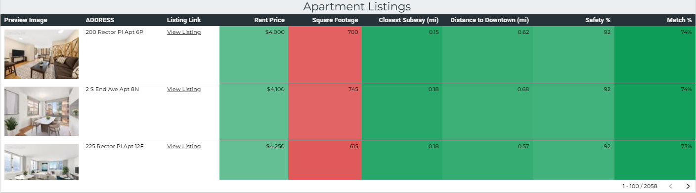

# NYC Apartment Search Dashboard

Explore the interactive Looker Studio dashboard:

**[NYC Apartment Search Dashboard](https://lookerstudio.google.com/u/0/reporting/9044b3e3-d3e2-41a0-b329-0b4d23c04764)**


## Overview

This project provides a dynamic apartment search dashboard for NYC and surrounding areas. The end-to-end pipeline integrates the following:

- Apartment listings via the Realtor.com API 
- Safety data by zip code (static CSV)
- Subway location data (static CSV)
- Snowflake and dbt for data warehousing and transformations
- Looker Studio dashboard for interactive exploration, weighing of apartment factors, and direct links to live listings

The initial API search is limited to the following pre-filtering:

- 300+ Square Feet
- Within 5 mi radius of Downtown Brooklyn (arbitrarily chosen as somewhat central across all five boroughs and surrounding cities)

Future iterations will provide additional filters for factors such as washer/dryer, outdoor space, etc, include a data model visualization,  implement dbt tests, and store historical data to view listing trends over time.
---

## Features

- Pulls latest apartment listings from Realtor.com API via RapidAPI
- User-adjustable weighting for 5 key apartment factors (price, sqft, distance to subway, distance to downtown, neighborhood safety score)
- Ranked Methodology of apartment recommendations based on weighting assigned (or the default of even 20% across all five factors)
- Modular dbt project for clean data transformations
- Snowflake data warehouse integration

---

## Getting Started

### Prerequisites

- Python 3.8+
- [Snowflake account](https://www.snowflake.com/)
- Access Key to Realtor.com API (via RapidAPI) saved as environment variable
- Looker Studio (Google account)

### Setup

1. Clone the repository

    ```bash
   git clone https://github.com/crowe32996/nyc-apartment-search.git
   cd nyc-apartment-search
    ```


2. Run the full pipeline with one command
    
    ```bash
    run_pipeline.bat
    ```
    You’ll be prompted to optionally re-run the Realtor.com API script. The option to keep current apartment_listings.csv in seeds allows for avoiding hitting API limits. 

    This script will:

    - Activate the virtual environment

    - Optionally refresh Realtor API apartment listings

    - Install required Python libraries

    - Run dbt to refresh staging models

    - Generate apartment scores table

    - Seed new CSV data into Snowflake

    - Run final dbt models to build dimensions

3. Configure Snowflake and RapidAPI Credentials

    Set your Snowflake connection info as environment variables or in your .dbt/profiles.yml file.

4. Open the Looker Studio dashboard and connect to your Snowflake data


### Features:
- **Adjustable weights** for key apartment factors like rent, square footage, safety, distance to subway, and distance to downtown
- **Real-time filtering** by price range, neighborhood, and features
- **Color-coded heatmaps** showing how listings rank across different dimensions
- **Interactive tables** with apartment previews, links, and normalized scores


### Additional Screenshots:

| Apartment Ranking Table | Neighborhood Summary |
|-------------------------|----------------------|
|  |  |

> To keep this working smoothly, periodically update the Snowflake extract or re-run the API 

## License

This project is licensed under the MIT License - see the [LICENSE](LICENSE) file for details.

---

## Contact

Your Name - cwr321@gmail.com  
Project Link: https://github.com/crowe32996/nyc-apartment-search
